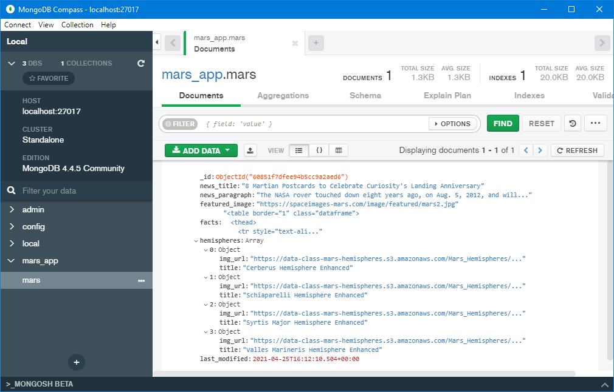

# Mission-to-Mars

CU-VIRT-DATA-PT-02-2021-U-B-TTH - Web Scraping with Python and MongoDB - Module 10

Paul Do 2021/04/25

# 

(illustration: NASA)

## Overview

The propose of this an

## Resources

1. Mars Planet Science Exploration Program, https://redplanetscience.com 

2. Nasa Jet Propulsion Laboratory, https://spaceimages-mars.com

3. Galaxy Facts, https://galaxyfacts-mars.com

4. GUSS Astrogeology Science Center, https://data-class-mars-hemispheres.s3.amazonaws.com/Mars_Hemispheres/index.html

- Jupyter Notebook and Python files: [Mission_to_Mars_Challenge.ipynb](Mission_to_Mars_Challenge.ipynb), [app.py](app.py), [scraping.py](scraping.py),
- Software: Jupyter notebook 6.1.4, MOngoDB 4.4.5, Python 3.7.9
- pip installs: Flask 1.1.2, Flask-PyMongo 2.3.0, splinter 0.14.0, bs4 0.0.1, pandas 1.1.3, webdriver-manager 3.4.0

## Results

scrape correctly wrote to the MongoDB document database:

Additional changes for Challenge 3, Added Background Image `background-image`, Changed button class to match Mars Colors `class="btn btn-warning"` and updated div column class with formatting for smart phones as well as Desktops `
`

## Summary

A Helicopter flew on Mars!